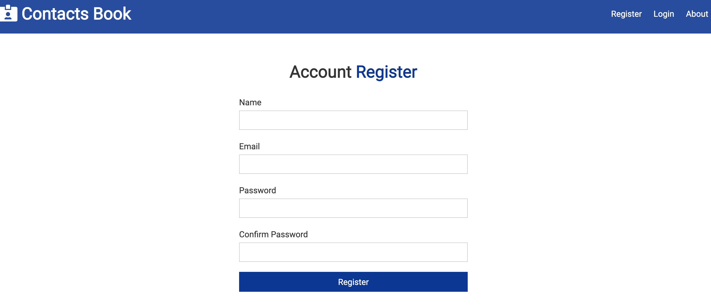
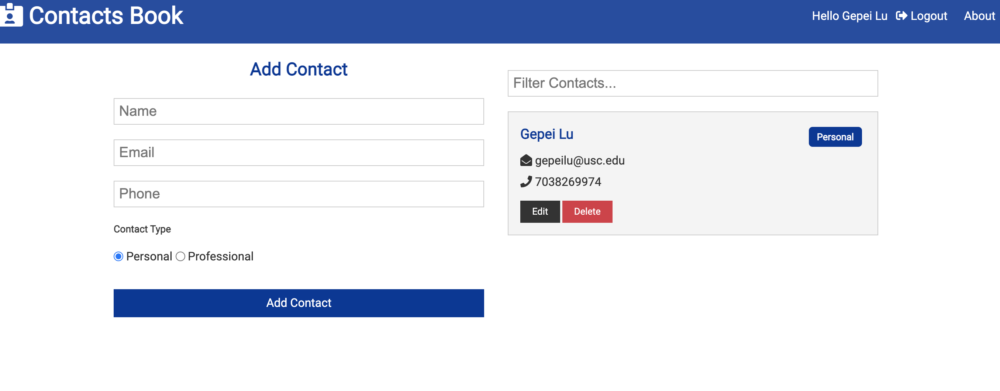

 ### Contacts Book - MERN stack app to manage user contacts 

```
git clone https://github.com/gpldirk/Contacts-Book.git
```

#### Fill out the mongoDB altas uri 
under config/config.copy.env \
MONGO_URI=


#### Start running the app locally
```
cd Contacts-Book
```
```
npm install && npm run clientinstall
```
```
npm run dev
```

#### Screen Shoot




Heroku Link: https://mighty-fjord-85520.herokuapp.com/


